# CI/CD Pipeline — Beginner's Guide

**Feb 26, 2026**

This guide provides a step-by-step walkthrough to set up a Continuous Integration/Continuous Deployment (CI/CD) pipeline using GitHub, Jenkins, Docker, and Terraform.

## 🗺️ What You Will Build

Your CI/CD pipeline will automate the following workflow:

```mermaid
graph TD
    A[You push code to GitHub] --> B[Jenkins gets notified via ngrok]
    B --> C[Jenkins runs tests and lint]
    C --> D[SonarQube checks code quality]
    D --> E[Docker builds and pushes your image]
    E --> F[Terraform deploys your container ✅]
```



### Tools Used

| Tool      | What it does                  | Port |
|-----------|-------------------------------|------|
| Jenkins   | Automates everything          | 8080 |
| SonarQube | Code quality scanner          | 9000 |
| Flask API | Your Python todo app          | 5000 |
| ngrok     | Tunnel GitHub → Jenkins       | —    |

## STEP 1 — Install Docker

Docker runs applications inside isolated containers. Install it first because Jenkins and SonarQube also run inside Docker.

```bash
sudo apt update
sudo apt install docker.io docker-compose -y
sudo usermod -aG docker $USER && newgrp docker
```

Verify your Docker installation:

```bash
docker --version
docker run hello-world
```

You should see "Hello from Docker!"

> 💡 The `usermod` command means you won't need `sudo` before every docker command.

## STEP 2 — Install Java & Jenkins

Jenkins is your automation engine. It watches GitHub and runs your pipeline automatically.

### 2a. Install Java:

```bash
sudo apt update
sudo apt install fontconfig openjdk-21-jre -y
java -version
# should print: openjdk version 21...
```

### 2b. Add Jenkins repository:

```bash
sudo wget -O /etc/apt/keyrings/jenkins-keyring.asc \
  https://pkg.jenkins.io/debian-stable/jenkins.io-2026.key

echo "deb [signed-by=/etc/apt/keyrings/jenkins-keyring.asc] \
  https://pkg.jenkins.io/debian-stable binary/" | \
  sudo tee /etc/apt/sources.list.d/jenkins.list > /dev/null

sudo apt update && sudo apt install jenkins -y
```

### 2c. Start Jenkins & give it Docker access:

```bash
sudo systemctl enable jenkins
sudo systemctl start jenkins
sudo usermod -aG docker jenkins
sudo systemctl restart jenkins
```

### 2d. Get your first-time login password:

```bash
sudo cat /var/lib/jenkins/secrets/initialAdminPassword
```

Open `http://localhost:8080` in your browser → paste the password → choose "Install suggested plugins" → create your admin user.

### 2e. Install extra plugins:

Go to: `Manage Jenkins` → `Plugins` → `Available plugins`

Search and install each one:

*   Docker Pipeline
*   Docker Commons Plugin
*   GitHub Integration Plugin
*   SonarQube Scanner

> 💡 Jenkins restarts after installing plugins. Wait for it to fully come back before continuing.

## STEP 3 — Start SonarQube

SonarQube scans your code for bugs and bad patterns. It runs as a Docker container — no complex installation needed.

### 3a. Start SonarQube:

```bash
docker run -d --name sonarqube -p 9000:9000 sonarqube:lts-community
```

Wait 60 seconds, then open `http://localhost:9000`.

Login: `admin` / `admin` → you'll be asked to set a new password.

### 3b. Generate a token for Jenkins:

Click your profile icon (top right) → `My Account`
Click the `Security` tab
Token name: `jenkins-token`
Type: `Global Analysis Token`
Click `Generate`
Copy the token NOW — you won't see it again!

> ⚠️ It looks like `sqa_abc123xyz...` — paste it in a notepad immediately.

### 3c. Add token to Jenkins:

`Jenkins` → `Manage Jenkins` → `Credentials` → `System` → `Global` → `Add Credentials`
Kind: `Secret text`
Secret: paste your SonarQube token
ID: `sonarqube-token`
Click `Save`

### 3d. Connect SonarQube to Jenkins:

`Jenkins` → `Manage Jenkins` → `System`
Scroll down to `SonarQube servers` → click `Add`
Name: `SonarQube`
Server URL: `http://YOUR_IP:9000`
Token: select `sonarqube-token`
Click `Save`

> 💡 Find your IP by running: `hostname -I` — use the first number, e.g., `172.31.66.217`.

### 3e. Add SonarQube Scanner tool:

`Jenkins` → `Manage Jenkins` → `Global Tool Configuration`
Scroll to `SonarQube Scanner` → click `Add`
Name: `SonarQube Scanner`
Check "Install automatically"
Click `Save`

### 3f. Fix Quality Gate timeout — DON'T SKIP THIS:

Without this, your pipeline will hang forever waiting for SonarQube.

`SonarQube` → `Administration` → `Configuration` → `Webhooks` → `Create`
Name: `jenkins-webhook`
Run `hostname -I` and use that IP
URL: `http://YOUR_IP:8080/sonarqube-webhook/`
Click `Save`

> ⚠️ Use your real local IP — NOT `localhost`. SonarQube is inside Docker so `localhost` points to itself, not Jenkins.

## STEP 4 — Install ngrok

GitHub needs to notify Jenkins when you push code. But Jenkins runs on your local machine which GitHub can't reach from the internet. ngrok solves this by creating a public URL that tunnels to your machine.

### 4a. Install ngrok:

```bash
curl -s https://ngrok-agent.s3.amazonaws.com/ngrok.asc | \
  sudo tee /etc/apt/trusted.gpg.d/ngrok.asc >/dev/null

echo "deb https://ngrok-agent.s3.amazonaws.com buster main" | \
  sudo tee /etc/apt/sources.list.d/ngrok.list

sudo apt update && sudo apt install -y ngrok
```

### 4b. Sign up & authenticate:

Go to [ngrok.com](https://ngrok.com) → Sign up free
Dashboard → copy your Authtoken
Run:

```bash
ngrok config add-authtoken YOUR_AUTHTOKEN_HERE
```

### 4c. Start the tunnel:

```bash
ngrok http 8080
```

You'll see output similar to this:

```
Forwarding   https://abc123.ngrok-free.app -> http://localhost:8080
```

Copy that `https://` URL — you need it in Step 5.

> ⚠️ Keep this terminal window open. If you close it, the tunnel stops and GitHub can't reach Jenkins.

## STEP 5 — Create GitHub Repo & Webhook

### 5a. Create your repo on GitHub first:

Go to [github.com](https://github.com) → `New repository` → name it `flask-terraform-pipeline` → `Public` → `Create`

### 5b. Push your code:

```bash
cd flask-terraform-pipeline
git init
git add .
git commit -m "first commit"
git branch -M main
git remote add origin https://github.com/furkanGitId/flask-terraform-pipeline.git
git push -u origin main
```

### 5c. Add a Webhook so GitHub notifies Jenkins:

`GitHub repo` → `Settings` → `Webhooks` → `Add webhook`
Payload URL: `https://YOUR-NGROK-URL/github-webhook/`
Content type: `application/json`
Events: select "Just the push event"
Active: ✅ checked
Click `Add webhook`

### 5d. Create a GitHub Personal Access Token (PAT):

Jenkins needs permission to read your repo.

`GitHub` → top right avatar → `Settings`
Scroll down → `Developer settings`
`Personal access tokens` → `Tokens (classic)`
Click `Generate new token (classic)`
Note: `Jenkins-Token`
Check these scopes: `repo` ✅ and `admin:repo_hook` ✅
Click `Generate token` → copy it immediately

### 5e. Add PAT to Jenkins:

`Jenkins` → `Manage Jenkins` → `Credentials` → `System` → `Global` → `Add Credentials`
Kind: `Secret text`
Secret: paste your GitHub PAT
ID: `github-token`
Click `Save`

`Jenkins` → `Manage Jenkins` → `System` → `GitHub section`
Click `Add GitHub Server` → select `github-token` → click `Test Connection`
You should see: ✅ Credentials verified

## STEP 6 — Install Terraform

Terraform deploys your Docker container using config files instead of manual commands.

```bash
wget -O- https://apt.releases.hashicorp.com/gpg | \
  sudo gpg --dearmor -o /usr/share/keyrings/hashicorp-archive-keyring.gpg

echo "deb [signed-by=/usr/share/keyrings/hashicorp-archive-keyring.gpg] \
  https://apt.releases.hashicorp.com $(lsb_release -cs) main" | \
  sudo tee /etc/apt/sources.list.d/hashicorp.list

sudo apt update && sudo apt install terraform -y
terraform -version
```

## STEP 7 — Add Docker Hub Credentials to Jenkins

Jenkins will push your Docker image to Docker Hub. Create a free account at [hub.docker.com](https://hub.docker.com) if you don't have one.

1.  `Jenkins` → `Manage Jenkins` → `Credentials` → `System` → `Global` → `Add Credentials`
2.  Kind: `Username with password`
3.  Username: your Docker Hub username
4.  Password: your Docker Hub password
5.  ID: `dockerhub-credentials`
6.  Click `Save`

Then open the `Jenkinsfile` from the project files and change this one line:

```groovy
DOCKER_HUB_REPO = "YOUR_DOCKERHUB_USERNAME/flask-terraform-pipeline"
```

Replace `YOUR_DOCKERHUB_USERNAME` with your actual Docker Hub username, for example:

```groovy
DOCKER_HUB_REPO = "furkandevops/flask-terraform-pipeline"
```

Then push the change:

```bash
git add Jenkinsfile
git commit -m "set my docker hub username"
git push
```

## STEP 8 — Create the Jenkins Pipeline Job

`Jenkins` → `New Item`
Name: `flask-terraform-pipeline`
Select `Pipeline` → click `OK`
Under `General`: check `GitHub project` → paste your GitHub repo URL
Under `Build Triggers`: check `GitHub hook trigger for GITScm polling`
Under `Pipeline`:
Definition: `Pipeline script from SCM`
SCM: `Git`
Repository URL: your GitHub repo URL
Branch: `*/main`
Script Path: `Jenkinsfile`
Click `Save`

## STEP 9 — First Full Pipeline Run! 🎉

Trigger the pipeline by pushing any small change:

```bash
echo "# test" >> README.md
git add .
git commit -m "trigger pipeline"
git push
```

Then in Jenkins, watch it go:

Go to `Jenkins` → `flask-terraform-pipeline`
A build starts automatically within a few seconds
Click the build number (e.g., `#1`) → `Console Output`
Watch every step run live

Your pipeline runs these stages in order:

| Stage                 | What happens                                  |
|-----------------------|-----------------------------------------------|
| Checkout              | Jenkins pulls your code from GitHub           |
| Install & Lint        | `pip install` + `flake8` checks your Python   |
| SonarQube Analysis    | Code is scanned for quality issues            |
| Quality Gate          | Pipeline stops here if quality fails          |
| Docker Build & Push   | Image built and pushed to Docker Hub          |
| Terraform Apply       | Container deployed on your machine            |
| Smoke Test            | Hits `/health` to confirm app is live         |

Test your live app:

```bash
curl http://localhost:5000/health
curl -X POST http://localhost:5000 \
  -H "Content-Type: application/json" \
  -d '{"title": "Buy milk"}'
```

## 🔧 Troubleshooting

*   **Quality Gate hangs forever** → You missed Step 3f. Go add the SonarQube webhook now using your real local IP.
*   **GitHub webhook returns 403** → Your GitHub PAT is missing `admin:repo_hook`. Delete and recreate it with both `repo` and `admin:repo_hook` checked.
*   **Docker push fails** → Check that `YOUR_DOCKERHUB_USERNAME` is updated in `Jenkinsfile` and the credential ID is exactly `dockerhub-credentials`.
*   **Jenkins build doesn't trigger on push** → Make sure ngrok is still running. Check the webhook delivery in `GitHub` → `repo Settings` → `Webhooks` → click your webhook → `Recent Deliveries`.
*   **Permission denied errors**

    ```bash
sudo chmod 666 /var/run/docker.sock
sudo systemctl restart jenkins
    ```

## 📋 All Credentials You Added to Jenkins

| Jenkins ID          | Type              | What it is                        |
|---------------------|-------------------|-----------------------------------|
| `sonarqube-token`   | Secret text       | SonarQube token (`sqa_...`)       |
| `github-token`      | Secret text       | GitHub PAT (`ghp_...`)            |
| `dockerhub-credentials` | Username/Password | Docker Hub login                  |

## 🌐 Your Todo API Endpoints

| Method | URL        | What it does              |
|--------|------------|---------------------------|
| `GET`  | `/health`  | Is the app running?       |
| `GET`  | `/`        | flask app                 |

---

## How each stage connects to the others

*   **Stage 1** → pulls code
*   **Stage 2** → installs packages from that code
*   **Stage 3** → tests that code, saves reports
*   **Stage 4** → sends code + reports to SonarQube
*   **Stage 5** → waits for SonarQube verdict (STOPS here if bad)
*   **Stage 6** → builds Docker image from that code
*   **Stage 7** → Terraform runs the Docker container
*   **Stage 8** → confirms the container is actually responding

### Two things you MUST change before using this

1.  **Line 4 — your Docker Hub username:**

    ```groovy
DOCKER_HUB_REPO = "YOUR_DOCKERHUB_USERNAME/flask-terraform-pipeline"
    ```

    Change `YOUR_DOCKERHUB_USERNAME` to your actual Docker Hub username, for example:

    ```groovy
DOCKER_HUB_REPO = "furkandevops/flask-terraform-pipeline"
    ```

2.  **Make sure these 3 credential IDs in Jenkins match exactly:**

    | Jenkinsfile variable      | Jenkins credential ID                 |
    |---------------------------|---------------------------------------|
    | `dockerhub-credentials`   | must be exactly this in Jenkins       |
    | `sonarqube-token`         | must be exactly this in Jenkins       |
    | `SonarQube`               | must match name in Jenkins → System → SonarQube servers |

---

## Where to save this file

Save it as `Jenkinsfile` in the **root of your project** (no file extension):

```
flask-terraform-pipeline/
├── Jenkinsfile          ← here
├── Dockerfile
├── app/
│   └── app.py
└── terraform/
    └── main.tf
```

Then push it:

```bash
git add Jenkinsfile
git commit -m "add Jenkinsfile"
git push
```

Jenkins will pick it up automatically on your next push. If you get stuck on any stage paste the red error from Console Output here and I'll fix it with you! 🙌

---

## Docker Hub Credential Environment Variable

Here's how your `Jenkinsfile` environment section should look with your Docker Hub details:

```groovy
pipeline {
    agent any
    environment {
        DOCKER_HUB_REPO  = "furkandevops/flask-terraform-pipeline"
        DOCKER_CRED_ID   = "dockerhub-credentials"
        IMAGE_TAG        = "${env.BUILD_NUMBER}"
    }
    // ... rest of your pipeline
}
```

Just replace `YOUR_DOCKERHUB_USERNAME` with `furkandevops`.

Also, double-check this in Jenkins:

When you added the Docker Hub credential in Jenkins, make sure it looks exactly like this:

| Field    | Value                     |
|----------|---------------------------|
| Kind     | `Username with password`  |
| Username | `furkandevops`            |
| Password | your Docker Hub password  |
| ID       | `dockerhub-credentials`   |

The ID `dockerhub-credentials` in Jenkins must match exactly what you wrote in `DOCKER_CRED_ID` in the `Jenkinsfile`. If even one letter is different it will fail.

After updating the `Jenkinsfile`, push the change:

```bash
git add Jenkinsfile
git commit -m "set docker hub username"
git push
```

## Terraform `main.tf` File

Here's your complete `terraform/main.tf` file:

```hcl
terraform {
  required_version = ">= 1.5"

  required_providers {
    docker = {
      source  = "kreuzwerker/docker"
      version = "~> 3.0"
    }
  }
}

# Connect Terraform to Docker on your machine
provider "docker" {
  host = "unix:///var/run/docker.sock"
}

# ── Variables ─────────────────────────────────────────────────────────────────
variable "docker_image" {
  description = "Image to deploy — passed in from Jenkinsfile"
  type        = string
  default     = "furkandevops/flask-terraform-pipeline:latest"
}

variable "app_port" {
  description = "Flask app port"
  type        = number
  default     = 5000
}

variable "container_name" {
  description = "Name of the running container"
  type        = string
  default     = "flask-terraform-app"
}

# ── Pull image from Docker Hub ────────────────────────────────────────────────
resource "docker_image" "app" {
  name         = var.docker_image
  keep_locally = false
}

# ── Remove old container and run new one ─────────────────────────────────────
resource "docker_container" "app" {
  name  = var.container_name
  image = docker_image.app.image_id

  # Always restart if it crashes
  restart = "always"

  # port 5000 inside container → port 5000 on your machine
  ports {
    internal = var.app_port
    external = var.app_port
  }

  env = [
    "FLASK_ENV=production"
  ]

  # Force replace container when image changes (new build = new container)
  must_run = true

  healthcheck {
    test         = ["CMD", "curl", "-f", "http://localhost:5000/health"]
    interval     = "30s"
    timeout      = "10s"
    retries      = 3
    start_period = "15s"
  }
}

# ── Print results after deploy ────────────────────────────────────────────────
output "app_url" {
  value = "http://localhost:${var.app_port}"
}

output "container_name" {
  value = docker_container.app.name
}

output "image_deployed" {
  value = var.docker_image
}
```

### Your folder structure should now be:

```
terraform/
└── main.tf     ← this file
```

Create it like this:

```bash
mkdir -p terraform
nano terraform/main.tf
# paste the code above, then Ctrl+X → Y → Enter to save
```

Then push to GitHub:

```bash
git add terraform/main.tf
git commit -m "add terraform config"
git push
```

### What each section does — in plain English

*   **`terraform` block** — tells Terraform which version it needs and which plugins to download. Here it downloads the Docker plugin so Terraform can control Docker.
*   **`provider "docker"`** — connects Terraform to Docker running on your machine via the Docker socket file.
*   **`variable` blocks** — settings you can change without editing the file. The `Jenkinsfile` passes `docker_image` in automatically with the build number tag.
*   **`docker_image`** — pulls your image from Docker Hub (same as running `docker pull furkandevops/flask-terraform-pipeline:latest`).
*   **`docker_container`** — runs your container (same as `docker run`) with port mapping, env vars, and a health check.
*   **`output` blocks** — after `terraform apply` finishes, these lines get printed so you can see your app URL.

### How Terraform connects to your Jenkinsfile

In the `Jenkinsfile` Stage 7, this command passes your image tag into Terraform:

```groovy
terraform plan -input=false \
    -var="docker_image=${DOCKER_HUB_REPO}:${IMAGE_TAG}" \
    -out=tfplan
```

So if Jenkins build number is 5, Terraform will deploy `furkandevops/flask-terraform-pipeline:5` — always the exact image from that build. No guessing which version is running!

---

## Updated Jenkinsfile (for flat project structure)

This `Jenkinsfile` is updated to match a flat project structure (where `app.py`, `requirements.txt`, etc., are in the root directory).

```groovy
pipeline {
    agent any

    environment {
        DOCKER_HUB_REPO  = "furkandevops/flask-terraform-pipeline"
        DOCKER_CRED_ID   = "dockerhub-credentials"
        IMAGE_TAG        = "${env.BUILD_NUMBER}"
    }

    stages {

        // ── STAGE 1 ──────────────────────────────────────────────────────────
        stage('Checkout') {
            steps {
                checkout scm
                echo "✅ Code pulled from GitHub"
            }
        }

        // ── STAGE 2 ──────────────────────────────────────────────────────────
        // requirements.txt is in root folder (not inside app/)
        stage('Install & Lint') {
            steps {
                sh '''
                    # Create bare venv (skips ensurepip)
                    python3 -m venv --without-pip venv

                    # Activate and bootstrap pip manually
                    . venv/bin/activate
                    curl https://bootstrap.pypa.io/get-pip.py -o get-pip.py
                    python get-pip.py --no-warn-script-location

                    # Now upgrade pip and install your deps
                    pip install --upgrade pip
                    pip install -r requirements.txt
                    pip install flake8  # if not in requirements.txt
                    flake8 app.py --max-line-length=120 || true
                '''
                echo "✅ Dependencies installed and lint passed"
            }
        }

        // ── STAGE 3 ──────────────────────────────────────────────────────────
        // Build Docker image and push to Docker Hub
        // furkandevops/flask-terraform-pipeline:1  (build number)
        // furkandevops/flask-terraform-pipeline:latest
        stage('Docker Build & Push') {
            steps {
                withCredentials([usernamePassword(
                    credentialsId: "${DOCKER_CRED_ID}", 
                    passwordVariable: 'DOCKERHUB_PASSWORD', 
                    usernameVariable: 'DOCKERHUB_USERNAME'
                )]) {
                    sh '''
                        echo "$DOCKERHUB_PASSWORD" | docker login -u "$DOCKERHUB_USERNAME" --password-stdin
                        docker build -t $DOCKER_HUB_REPO:$IMAGE_TAG .
                        docker tag  $DOCKER_HUB_REPO:$IMAGE_TAG $DOCKER_HUB_REPO:latest
                        docker push $DOCKER_HUB_REPO:$IMAGE_TAG
                        docker push $DOCKER_HUB_REPO:latest
                    '''
                }
            }
        }

        // ── STAGE 4 ──────────────────────────────────────────────────────────
        // Terraform pulls the image and runs it as a container
        stage('Terraform Deploy') {
            steps {
                dir('terraform') {
                    sh '''
                        docker rm -f flask-terraform-app || true

                        terraform init -input=false
                        terraform plan -input=false \
                        -var="docker_image=${DOCKER_HUB_REPO}:${IMAGE_TAG}" \
                        -out=tfplan
                        terraform apply -input=false -auto-approve tfplan
                    '''
                }
            }
        }


        // ── STAGE 5 ──────────────────────────────────────────────────────────
        // Confirm the container is actually running and responding
        stage('Smoke Test') {
            steps {
                sh '''
                    sleep 5
                    curl -sf http://localhost:5000/health
                    echo ""
                    echo "✅ App is live at http://localhost:5000"
                '''
            }
        }
    }

    post {
        success {
            echo "🎉 Pipeline SUCCESS — Build #${env.BUILD_NUMBER} deployed!"
            echo "🌐 App running at http://localhost:5000"
        }
        failure {
            echo "❌ Pipeline FAILED — check the red stage above"
        }
        always {
            sh 'docker image prune -f || true'
            cleanWs()
        }
    }
}
```

## Updated `terraform/main.tf` (for flat project structure)

```hcl
terraform {
  required_version = ">= 1.5"

  required_providers {
    docker = {
      source  = "kreuzwerker/docker"
      version = "~> 3.0"
    }
  }
}

# Connect Terraform to Docker on your machine
provider "docker" {
  host = "unix:///var/run/docker.sock"
}

# ── Variables ─────────────────────────────────────────────────────────────────
variable "docker_image" {
  description = "Image to deploy — passed in from Jenkinsfile"
  type        = string
  default     = "furkandevops/flask-terraform-pipeline:latest"
}

variable "app_port" {
  description = "Flask app port"
  type        = number
  default     = 5000
}

variable "container_name" {
  description = "Name of the running container"
  type        = string
  default     = "flask-terraform-app"
}

# ── Pull image from Docker Hub ────────────────────────────────────────────────
resource "docker_image" "app" {
  name         = var.docker_image
  keep_locally = false
}

# ── Remove old container and run new one ─────────────────────────────────────
resource "docker_container" "app" {
  name  = var.container_name
  image = docker_image.app.image_id

  # Always restart if it crashes
  restart = "always"

  # port 5000 inside container → port 5000 on your machine
  ports {
    internal = var.app_port
    external = var.app_port
  }

  env = [
    "FLASK_ENV=production"
  ]

  # Force replace container when image changes (new build = new container)
  must_run = true

  healthcheck {
    test         = ["CMD", "curl", "-f", "http://localhost:5000/health"]
    interval     = "30s"
    timeout      = "10s"
    retries      = 3
    start_period = "15s"
  }
}

# ── Print results after deploy ────────────────────────────────────────────────
output "app_url" {
  value = "http://localhost:${var.app_port}"
}

output "container_name" {
  value = docker_container.app.name
}

output "image_deployed" {
  value = var.docker_image
}
```

## Summary of Changes

| File              | What changed                                                              |
|-------------------|---------------------------------------------------------------------------|
| `Jenkinsfile`     | `app/requirements.txt` → `requirements.txt` (root)                        |
| `Jenkinsfile`     | `flake8 app/` → `flake8 app.py` (single file)                             |
| `Jenkinsfile`     | Removed SonarQube stages (commented out in the original, now removed for clarity) |
| `Jenkinsfile`     | 8 stages → 6 stages (cleaner)                                             |
| `terraform/main.tf` | Added `must_run = true` so old container gets replaced on every deploy    |

Push everything to GitHub:

```bash
git add Jenkinsfile terraform/main.tf
git commit -m "fix paths and update terraform"
git push
```

Then in Jenkins click `Build Now` — it will run all 6 stages automatically. ✅

# Complete Line-by-Line Explanation: Terraform + Jenkins Pipeline

## 📄 MAIN.TF (Terraform Configuration)

### Block 1: Terraform Settings
```hcl
terraform {
  required_version = ">= 1.5"
}
```
- `terraform {}` — The root configuration block for Terraform itself
- `required_version = ">= 1.5"` — This project refuses to run on Terraform older than v1.5. Prevents bugs from outdated syntax

```hcl
required_providers {
    docker = {
      source  = "kreuzwerker/docker"
      version = "~> 3.0"
    }
  }
}
```
- `required_providers` — Declares external plugins Terraform needs to download
- `docker` — We're naming this provider "docker" (we reference it later)
- `source = "kreuzwerker/docker"` — Download from the Terraform Registry. Path = registry.terraform.io/kreuzwerker/docker
- `version = "~> 3.0"` — Allow 3.x (3.0, 3.1, 3.9...) but NOT 4.0. The ~> means "pessimistic constraint"

### Block 2: Provider Configuration
```hcl
provider "docker" {
  host = "unix:///var/run/docker.sock"
}
```
- `provider "docker"` — Configures HOW Terraform talks to Docker
- `host = "unix:///var/run/docker.sock"` — Connect via Unix socket (the local Docker daemon). This is how CLI commands like `docker ps` work under the hood
- On Windows this would be `npipe:////./pipe/docker_engine`

### Block 3: Variables (Inputs)
```hcl
variable "docker_image" {
  description = "Image to deploy — passed in from Jenkinsfile"
  type        = string
  default     = "furkandevops/flask-terraform-pipeline:latest"
}
```
- `variable` — Declares an input parameter (like a function argument)
- `description` — Human-readable docs. Shows up in `terraform plan` output
- `type = string` — Validates that whoever passes this variable gives a string
- `default` — Used if no value is passed. Jenkins will override this with the actual build tag

```hcl
variable "app_port" {
  type    = number
  default = 5000
}
```
- `type = number` — Only accepts numbers, rejects "5000" as a string (type safety)

```hcl
variable "container_name" {
  type    = string
  default = "flask-terraform-app"
}
```
- This name will be used as the Docker container's name (`docker ps` will show this)

### Block 4: Docker Image Resource
```hcl
resource "docker_image" "app" {
  name         = var.docker_image
  keep_locally = false
}
```
- `resource "docker_image" "app"` — Two-part name:
  - `docker_image` = the resource type (from the `kreuzwerker` provider)
  - `app` = your local label (used to reference this resource elsewhere)
- `name = var.docker_image` — Pull this image from Docker Hub. `var.docker_image` reads the variable defined above
- `keep_locally = false` — When you run `terraform destroy`, delete the image from local disk too. `true` would keep it cached

### Block 5: Docker Container Resource
```hcl
resource "docker_container" "app" {
  name  = var.container_name
  image = docker_image.app.image_id
```
- `docker_container` = resource type for running containers
- `"app"` = local label
- `name = var.container_name` → container named `flask-terraform-app`
- `image = docker_image.app.image_id` — Reference the image ID (SHA hash) from the resource above. This creates an implicit dependency — Terraform pulls the image FIRST, then creates the container

```hcl
  restart = "always"
```
- Docker restart policy: `always` = restart if it crashes OR if Docker daemon restarts. Options: `no`, `on-failure`, `unless-stopped`, `always`

```hcl
  ports {
    internal = var.app_port   # Port INSIDE the container (Flask listens here)
    external = var.app_port   # Port on YOUR machine (you browse here)
  }
```
- Maps `localhost:5000` → `container:5000`
- Like `docker run -p 5000:5000`

```hcl
  env = [
    "FLASK_ENV=production"
  ]
```
- Injects environment variables into the container
- Flask uses `FLASK_ENV` to disable debug mode, enable optimizations

```hcl
  must_run = true
```
- Terraform will error if the container stops. Ensures the container stays running after apply

```hcl
  healthcheck {
    test         = ["CMD", "curl", "-f", "http://localhost:5000/health"]
    interval     = "30s"
    timeout      = "10s"
    retries      = 3
    start_period = "15s"
  }
}
```
- `test` — Command Docker runs to check health. `-f` makes `curl` fail on HTTP errors
- `interval` — Check every 30 seconds
- `timeout` — If `curl` takes >10s, mark as failed
- `retries` — After 3 consecutive failures → container marked unhealthy
- `start_period` — Wait 15s after startup before counting failures (app needs time to boot)

### Block 6: Outputs
```hcl
output "app_url" {
  value = "http://localhost:${var.app_port}"
}
output "container_name" {
  value = docker_container.app.name
}
output "image_deployed" {
  value = var.docker_image
}
```
- `Outputs` print to terminal after `terraform apply` completes
- Also queryable with `terraform output app_url`
- `${var.app_port}` = string interpolation (embeds variable value into string)
- `docker_container.app.name` = reads the `.name` attribute from the container resource

## 📄 JENKINSFILE (CI/CD Pipeline)

### Pipeline Structure
```groovy
pipeline {
    agent any
}
```
- `pipeline {}` — Declarative pipeline syntax (modern Jenkins)
- `agent any` — Run on any available Jenkins node/executor. Could be `agent { label 'linux' }` to target specific machines

### Environment Variables
```groovy
environment {
    DOCKER_HUB_REPO  = "furkandevops/flask-terraform-pipeline"
    DOCKER_CRED_ID   = "dockerhub-credentials"
    IMAGE_TAG        = "${env.BUILD_NUMBER}"
}
```
- `environment {}` — Declares variables available to ALL stages
- `DOCKER_HUB_REPO` — The Docker Hub repo path (username/repo-name)
- `DOCKER_CRED_ID` — The ID string of credentials stored in Jenkins Credentials Manager (not the actual password!)
- `IMAGE_TAG = "${env.BUILD_NUMBER}"` — Jenkins auto-increments `BUILD_NUMBER` each run. So build 42 creates tag `:42`. This makes every build traceable and rollbackable

### Stage 1: Checkout
```groovy
stage('Checkout') {
    steps {
        checkout scm
        echo "✅ Code pulled from GitHub"
    }
}
```
- `checkout scm` — `scm` = Source Control Management. Pulls code from whatever repo is configured in the Jenkins job (GitHub, GitLab, etc.)
- Downloads the exact commit that triggered this pipeline run

### Stage 2: Install & Lint
```groovy
stage('Install & Lint') {
    steps {
        sh '''
            python3 -m venv --without-pip venv
'''
```
- `sh '''...'''` — Runs a multi-line shell script on the Jenkins agent
- `python3 -m venv` — Creates an isolated Python environment in a folder called `venv`
- `--without-pip` — Skip installing pip during `venv` creation (workaround for restricted environments)

```groovy
            . venv/bin/activate
            curl https://bootstrap.pypa.io/get-pip.py -o get-pip.py
            python get-pip.py --no-warn-script-location
```
- `. venv/bin/activate` — The dot (`.`) = `source`. Activates the virtual environment
- Downloads pip installer script from the official Python authority
- Installs pip manually into the `venv`

```groovy
            pip install --upgrade pip
            pip install -r requirements.txt
            pip install flake8
            flake8 app.py --max-line-length=120 || true
        '''
    }
}
```
- `pip install -r requirements.txt` — Installs all app dependencies listed in that file
- `flake8 app.py` — Linter: checks Python code style and catches errors (unused imports, bad syntax, etc.)
- `--max-line-length=120` — Allow lines up to 120 chars (default is 79)
- `|| true` — Even if `flake8` finds issues, don't fail the pipeline. Remove this in strict projects

### Stage 3: Docker Build & Push
```groovy
stage('Docker Build & Push') {
    steps {
        withCredentials([usernamePassword(
            credentialsId: "${DOCKER_CRED_ID}", 
            passwordVariable: 'DOCKERHUB_PASSWORD', 
            usernameVariable: 'DOCKERHUB_USERNAME')]) {
```
- `withCredentials` — Securely injects credentials. The actual password is never visible in logs (Jenkins masks it)
- `credentialsId` — Looks up stored credentials by the ID we defined in `environment`
- `passwordVariable / usernameVariable` — Names of shell variables Jenkins creates temporarily

```groovy
            sh """
                echo "${DOCKERHUB_PASSWORD}" | docker login -u "${DOCKERHUB_USERNAME}" --password-stdin
```
- `"""` — Double-quote heredoc (allows variable interpolation, unlike `'''`)
- Pipes the password via `stdin` — more secure than `-p password` (which appears in process list)

```groovy
                docker build -t ${DOCKER_HUB_REPO}:${IMAGE_TAG} .
                docker build -t ${DOCKER_HUB_REPO}:latest .
```
- Builds the image twice with different tags:
  - `:42` (specific build number) → for rollbacks, audit trail
  - `:latest` → always points to newest build
- The `.` = build context is the current directory (uses `Dockerfile` in root)

```groovy
                docker push ${DOCKER_HUB_REPO}:${IMAGE_TAG}
                docker push ${DOCKER_HUB_REPO}:latest
            """
        }
    }
}
```
- Uploads both tagged images to Docker Hub so Terraform can pull them

### Stage 4: Terraform Deploy
```groovy
stage('Terraform Deploy') {
    steps {
        dir('terraform') {
```
- `dir('terraform')` — Changes working directory to the `terraform/` folder for all commands inside

```groovy
            sh '''
                docker rm -f flask-terraform-app || true
'''
```
- Force-removes the old container before Terraform runs
- Without this, Terraform may fail trying to create a container with a name that already exists
- `|| true` — If container doesn't exist yet, don't fail

```groovy
                terraform init -input=false
```
- Downloads providers (the Docker plugin), sets up backend
- `-input=false` — Never prompt for input (essential for automation — pipelines can't type answers)

```groovy
                terraform plan -input=false \
                -var="docker_image=${DOCKER_HUB_REPO}:${IMAGE_TAG}" \
                -out=tfplan
```
- `plan` — Calculates what changes Terraform will make (like a dry run)
- `-var="docker_image=..."` — Overrides the default variable with the actual build tag (e.g., `:42`)
- `-out=tfplan` — Saves the plan to a file. This guarantees apply executes exactly what was planned (no drift)

```groovy
                terraform apply -input=false -auto-approve tfplan
            '''
        }
    }
}
```
- `apply` — Executes the saved plan
- `-auto-approve` — Skip the "yes/no" confirmation prompt
- `tfplan` — Use the saved plan file (not a fresh calculation)

### Stage 5: Smoke Test
```groovy
stage('Smoke Test') {
    steps {
        sh '''
            sleep 5
            curl -sf http://localhost:5000/health
            echo ""
            echo "✅ App is live at http://localhost:5000"
        '''
    }
}
```
- `sleep 5` — Wait 5 seconds for the container to fully start
- `curl -sf` — `-s` = silent (no progress bar), `-f` = fail with exit code on HTTP errors (4xx/5xx)
- Hits the `/health` endpoint — if Flask responds with `200 OK`, the stage passes
- If `curl` fails (non-zero exit), Jenkins marks the stage RED and pipeline fails

### Post Actions
```groovy
post {
    success {
        echo "🎉 Pipeline SUCCESS — Build #${env.BUILD_NUMBER} deployed!"
    }
    failure {
        echo "❌ Pipeline FAILED — check the red stage above"
    }
    always {
        sh 'docker image prune -f || true'
        cleanWs()
    }
}
```
- `post {}` — Runs **after all stages**, regardless of outcome
- `success` — Only runs if ALL stages passed
- `failure` — Only runs if any stage failed
- `always` — Runs no matter what (cleanup)
- `docker image prune -f` — Deletes **dangling images** (untagged leftover layers) to free disk space
- `cleanWs()` — Jenkins built-in: deletes the workspace folder to keep the agent clean

---

## 🗺️ How It All Connects
```
GitHub Push
    │
    ▼
Jenkins pulls code (Checkout)
    │
    ▼
Install deps + lint Python (Install & Lint)
    │
    ▼
Build Docker image → Push to Docker Hub (Docker Build & Push)
  :42 + :latest
    │
    ▼
Terraform pulls :42 from Docker Hub
Terraform runs it as a container on port 5000 (Terraform Deploy)
    │
    ▼
curl /health confirms app is live (Smoke Test)
    │
    ▼
Cleanup dangling images + workspace
```
Every build gets a unique tag (`:42`, `:43`...) so you can always roll back by running Terraform with an older tag. Terraform manages the container declaratively — you describe what you want, it figures out how to get there.
